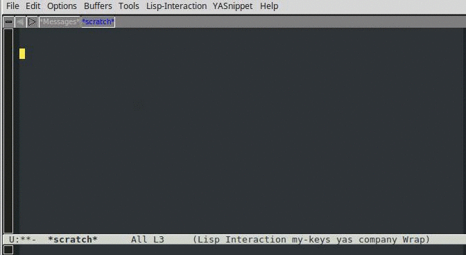

This is my self contained dotemacs configuration with some extra routines added over the years. You can find some extra packages also avilable on melpa but for various reasons I preferred to kept them baked into this repo. The goal is to keep the configuration relatively small and only add features which frequently used. adhering as much as possible to standard Emacs UX.

#### Packages (in the order of importance)
- desktop+ - managing sets of buffers (per project)
- dumb-jump - simply and rock-solid 'jump-to-definiton' for python projects
- multiple-cursors - similar to sublime
- tabbar - grouping buffers of the same time into tabs
- bookmarks (bm) - primarily used for sending parts of a buffer to python interpreter
- ace-jump-mode - jump to a character in a buffer
- (auto-complete)
- company-mode
- yasnipets
- cmake-mode
- markdown-mode

#### Optional External dependencies
- rclone (required by dropbox-* functions)
- cquery (c++-mode) - manually enabled in a buffer `C-c 5`
- clangd (c++-mode) - manually enabled in a buffer `C-x 5`

#### Custom routines
These are located in `emacs.d/modules/myfuncs.el` and are mostly add-hock experimetnations. Some are useful enough to be include in .emacs. 
##### Check out the following:
- `dropbox-ls` / `dropbox-get` / `dropbox-send` - sync files with dropbox using rclone
- `dumb-jump-set-include-paths` - override project path used by dumbjump (can include multiple roots)
- `selectback-exec` - find the text region (between bookmarks) to send to python interpreter
- `add-to-global-ring` / `go-ring-back` - my version of moving back/forth between cursor portions in buffers
- `comment-or-uncomment-this` - more intuitive line comment insertion
- `occur-methods` - list python/c++ functions
- `sort-buffers`
- `tabbar-move-current-tab-one-place-right` (and `left`)

### General purpose features
- Modified ffap to jump directly to a line number if the path contains it.
  For instance `/tmp/aaa.c:123`
  
  

- Rename files using multiple cursors

  

- Ediff mode with whitespace

  Split buffers vertically (using the same window) with white-space mode enabled.
  Once diffing completes undo split and go back to the original buffer layout.
  
  

- Save/load current desktop

  

- Send code snippets within the boundary of two bookmarks to Python session.

  

- Display and copy the current file path into the clipboard.

  

- Go back to the previous window layout

  For instance allows to temporarily display buffer in full window and return to previous layout.
  
  

- Sync current file with dropbox (external dependency: rclone)

  

### Navigation
- Cursor history

  Push cursor location into a ring. While moving back/forth retain the order of locations in the ring.
  
  

- Lists functions in a buffer

  This method piggy-backs on occur
  
  

- Lightweight jump to definition (non C++)

  

- Enable lsp/cquery in current buffer (external dependency: cquery/llvm)

  Requires building cquery (and have llvm7.0.0 dependency).

  

